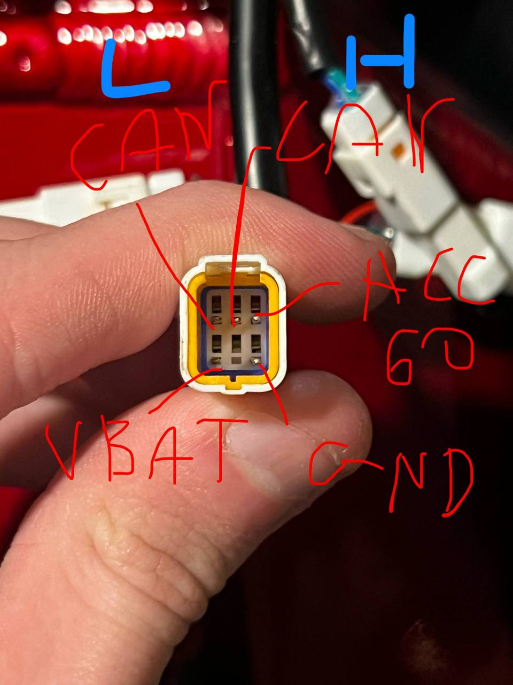

Talaria XXX T-Box Emulator
=========================

CAN-level emulator of the Talaria XXX T-Box module, implementing a subset of the
reverse-engineered CAN protocol for research, diagnostics, and bench testing.

This project simulates T-Box request/response behavior on the CAN bus and allows
development and analysis without original hardware present.

Features
--------

- CAN protocol emulation using MCP2515
- Handles multiple request/response channels
- Deterministic encrypted payload generation
- Retry and keepalive behavior matching observed traffic
- Designed for bench testing, analysis, and interoperability research

Implemented CAN Frames
----------------------

Incoming (requests):
- 0x208  Lock-related request
- 0x102  Remote-related request

Outgoing (responses):
- 0x504  Lock response
- 0x505  Remote response

Responses consist of an encrypted 8-byte payload followed by scheduled empty
frames to emulate expected bus behavior.

Hardware Requirements
---------------------

- Arduino-compatible MCU
- MCP2515 CAN controller (8 MHz crystal)
- 120 ohm termination on CAN bus (enable by jumper on MCP2515)

Typical Wiring
--------------

MCP2515 -> MCU
- CS    -> D10
- SCK   -> SPI SCK
- MOSI  -> SPI MOSI
- MISO  -> SPI MISO
- INT   -> optional

MCP2515 -> Talaria:
  

Build & Flash
-------------

1. Install required libraries:
   - mcp_can
   - SPI

2. Default CAN configuration:
   CAN.begin(MCP_ANY, CAN_250KBPS, MCP_8MHZ)

3. Flash firmware to the MCU.

4. Open Serial Monitor at 115200 baud.

Notes on Implementation
-----------------------

- Payload encryption is fully implemented in source code
- No OEM firmware, keys, or binary blobs are included
- Timing and retry behavior is configurable
- Code structure allows easy extension to additional channels or modes

Disclaimer
----------

This project is intended for educational, research, and diagnostic purposes only.

It does not include proprietary firmware, copyrighted material, or vendor-owned
binaries. Users are responsible for ensuring compliance with applicable laws and
regulations.

License
-------

MIT License
See LICENSE file for details.
